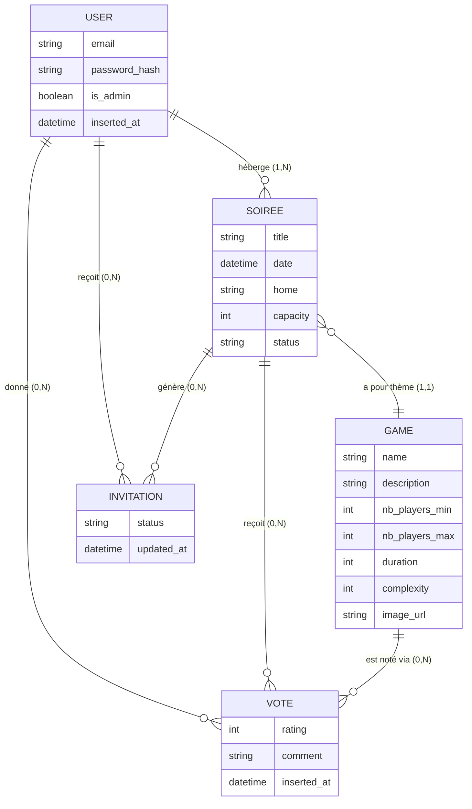

# Modèle Conceptuel de Données (MCD)

Le MCD décrit les **entités du métier** et leurs **relations**, indépendamment
de tout choix technique (clé primaire, type SQL, contrainte d'index…). Le
passage au modèle logique est traité dans [`MLD.md`](MLD.md).

## Diagramme

## Lecture des entités

- **USER** — toute personne inscrite. Possède un rôle membre par défaut ou
  admin. L'unicité de l'email est garantie au niveau base.
- **GAME** — jeu du catalogue, partagé entre tous les utilisateurs. Géré
  uniquement par les admins.
- **SOIREE** — événement organisé par un hôte (`USER`) à une date donnée,
  centré sur un jeu (`GAME`). Possède un état `:active` ou `:cancelled`.
- **INVITATION** — porte la relation N-N entre `USER` et `SOIREE` enrichie
  d'un attribut `status` (`pending`, `yes`, `no`, `maybe`). L'hôte d'une
  soirée y figure automatiquement avec `status = yes`.
- **VOTE** — note de 1 à 5 donnée par un participant confirmé sur le jeu
  joué à une soirée passée. Peut être assortie d'un commentaire textuel
  optionnel.

## Cardinalités notables

| Relation                       | Cardinalité    | Justification métier                                       |
|--------------------------------|----------------|------------------------------------------------------------|
| `USER` héberge `SOIREE`        | 1,1 ↔ 0,N      | Une soirée a un seul hôte ; un user peut héberger 0..N soirées |
| `SOIREE` a pour thème `GAME`   | 1,1 ↔ 0,N      | Choix de conception : une soirée = un jeu thème. Voir `modelisation.md`. |
| `USER` × `SOIREE` via `INVITATION` | 0,N ↔ 0,N (porteuse) | RSVP + ordre de visite, unique par couple (user, soiree)     |
| `USER` × `SOIREE` × `GAME` via `VOTE` | 0,N ↔ 0,N ↔ 0,N | Notation unique par triplet (user, soiree, game)            |

## Règles d'intégrité

- Email **unique** sur `USER`.
- Couple (`user_id`, `soiree_id`) **unique** sur `INVITATION`.
- Triplet (`user_id`, `soiree_id`, `game_id`) **unique** sur `VOTE`.
- `SOIREE.capacity ≥ 1`, `GAME.complexity ∈ [1, 5]`, `VOTE.rating ∈ [1, 5]`.
- `SOIREE.status ∈ {active, cancelled}` — transition `:active → :cancelled`
  uniquement, irréversible.
- Toutes les entités possèdent un horodatage `inserted_at` / `updated_at`
  hérité d'Ecto (cf. `timestamps(type: :utc_datetime)`).

Pour la traduction vers le schéma physique et les choix de cascade /
restriction sur suppression, voir [`MLD.md`](MLD.md) et
[`modelisation.md`](modelisation.md).
