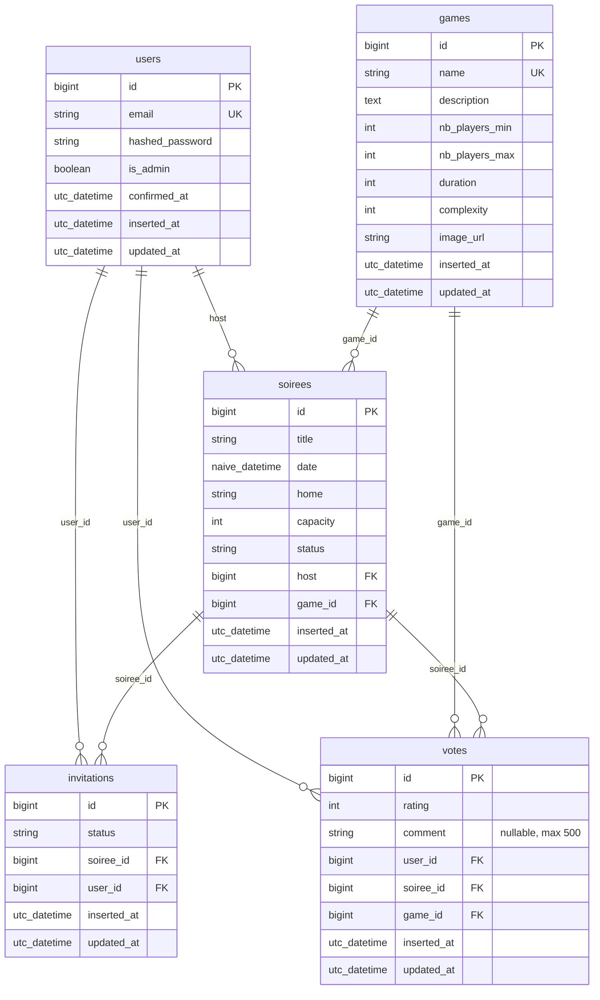

# Modèle Logique de Données (MLD)

Traduction du [MCD](MCD.md) en tables relationnelles, avec clés primaires,
clés étrangères, contraintes d'unicité et types SQL. Reflète fidèlement les
migrations Ecto présentes dans [`priv/repo/migrations/`](../priv/repo/migrations).

## Diagramme

## Tables et contraintes

### `users`

| Colonne         | Type            | Contraintes |
|-----------------|-----------------|-------------|
| `id`            | bigserial       | PK          |
| `email`         | citext          | NOT NULL, UNIQUE |
| `hashed_password` | string        | NOT NULL — généré par `Bcrypt.hash_pwd_salt/1` |
| `is_admin`      | boolean         | NOT NULL, default `false` |
| `confirmed_at`  | utc_datetime    | nullable    |
| `inserted_at`, `updated_at` | utc_datetime | NOT NULL |

Tables associées générées par `phx.gen.auth` : `users_tokens` (sessions et
magic links) — non listée pour la lisibilité.

### `games`

| Colonne          | Type   | Contraintes |
|------------------|--------|-------------|
| `id`             | bigserial | PK     |
| `name`           | string | NOT NULL ; **unique métier**, à protéger par `unique_index` (cf. dette identifiée — voir `modelisation.md`) |
| `description`    | text   | NOT NULL    |
| `nb_players_min` | int    | NOT NULL, ≥ 1 |
| `nb_players_max` | int    | NOT NULL, ≥ `nb_players_min` |
| `duration`       | int    | NOT NULL, > 0 (minutes) |
| `complexity`     | int    | NOT NULL, ∈ [1,5] |
| `image_url`      | string | nullable    |

### `soirees`

| Colonne        | Type            | Contraintes |
|----------------|-----------------|-------------|
| `id`           | bigserial       | PK          |
| `title`        | string          | NOT NULL    |
| `date`         | naive_datetime  | NOT NULL    |
| `home`         | string          | NOT NULL    |
| `capacity`     | int             | NOT NULL, > 0 |
| `status`       | string          | NOT NULL, default `"active"`, ∈ {`active`, `cancelled`} (indexée) |
| `host`         | bigint          | FK → `users(id)`, NOT NULL |
| `game_id`      | bigint          | FK → `games(id)`, NOT NULL |

### `invitations`

| Colonne        | Type            | Contraintes |
|----------------|-----------------|-------------|
| `id`           | bigserial       | PK          |
| `status`       | string (enum)   | ∈ {`pending`, `yes`, `no`, `maybe`}, default `pending` |
| `soiree_id`    | bigint          | FK → `soirees(id)`, NOT NULL, `on_delete: :delete_all` |
| `user_id`      | bigint          | FK → `users(id)`, NOT NULL |

**Index** : `UNIQUE (soiree_id, user_id)` — un seul RSVP par couple.

### `votes`

| Colonne        | Type            | Contraintes |
|----------------|-----------------|-------------|
| `id`           | bigserial       | PK          |
| `rating`       | int             | NOT NULL, ∈ [1,5] |
| `comment`      | string (≤ 500)  | nullable    |
| `user_id`      | bigint          | FK → `users(id)`, NOT NULL, `on_delete: :delete_all` |
| `soiree_id`    | bigint          | FK → `soirees(id)`, NOT NULL, `on_delete: :delete_all` |
| `game_id`      | bigint          | FK → `games(id)`, NOT NULL, `on_delete: :delete_all` |

**Index** :
- `UNIQUE (user_id, soiree_id, game_id)` — une seule note par triplet.
- Index simples sur `user_id`, `soiree_id`, `game_id` pour accélérer les jointures.

## Choix de cascade / restriction

La gestion `on_delete` actuelle est volontairement **agressive** (`:delete_all`)
pour les FK de `invitations` et `votes`, afin de garder la cohérence après
suppression d'une soirée ou d'un user. Une réflexion plus fine est documentée
dans [`modelisation.md`](modelisation.md), notamment le cas de la suppression
d'un jeu du catalogue (qui aujourd'hui supprime les votes liés — dette).

## Historique des migrations

Les migrations sont chronologiques dans [`priv/repo/migrations/`](../priv/repo/migrations) :

| Date         | Migration                                  | Objet                              |
|--------------|--------------------------------------------|------------------------------------|
| 20260511...  | `create_users_auth_tables`                 | Génération `phx.gen.auth`          |
| 20260511...  | `ajout_du_champs_admin`                    | `is_admin` sur `users`             |
| 20260511...  | `create_games`                             | Table catalogue                    |
| 20260512...  | `ajout_champs_game`                        | Description, nb_joueurs, etc.      |
| 20260512...  | `create_soirees`                           | Table soirées                      |
| 20260513...  | `create_invitations`                       | RSVP                               |
| 20260513...  | `create_votes`                             | Notation                           |
| 20260515...  | `add_comment_to_votes`                     | Commentaire optionnel sur vote (US11) |
| 20260515...  | `add_status_to_soirees`                    | Statut `:active`/`:cancelled` (US10) |
