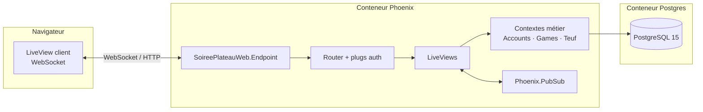
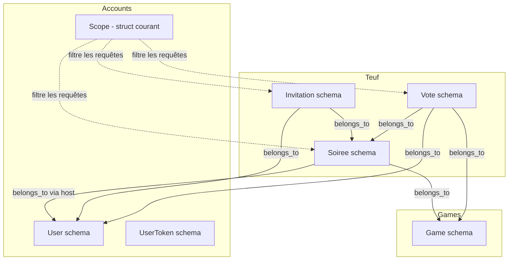
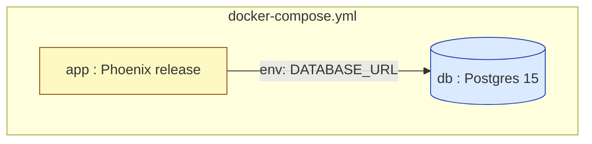
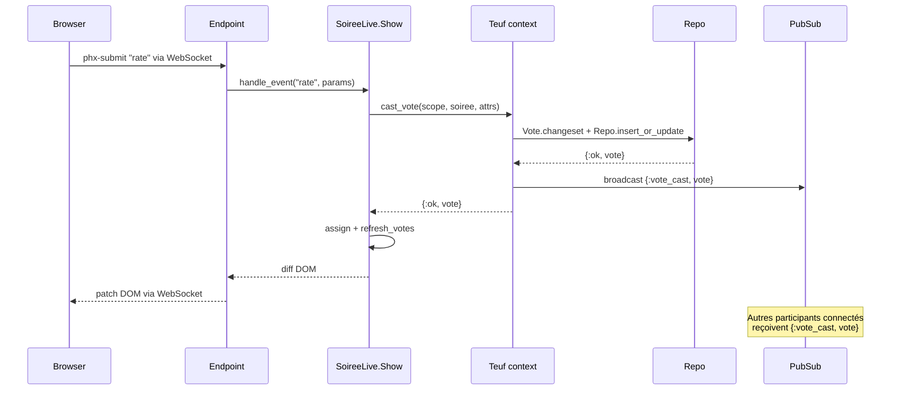

# Architecture

## Vue d'ensemble

L'application est une **Phoenix LiveView** monolithique, conteneurisée, qui
s'appuie sur PostgreSQL pour la persistance. Le rendu est intégralement
serveur ; le client n'embarque que le runtime LiveView (~150 KB) qui gère les
mises à jour DOM via WebSocket.

## Séparation en couches

Le projet respecte la séparation **présentation / métier / persistance**
attendue par le brief, traduite par la structure idiomatique Phoenix :

| Couche         | Responsabilité                                | Localisation                                    |
|----------------|-----------------------------------------------|-------------------------------------------------|
| Présentation   | Rendu HTML, gestion des événements UI         | `lib/soiree_plateau_web/live/`, `components/`   |
| Métier         | Règles, autorisations, orchestration          | `lib/soiree_plateau/accounts/`, `games/`, `teuf/` |
| Persistance    | Schémas Ecto, requêtes                        | mêmes dossiers que métier — schémas `.ex` + `Repo` |

**Aucune** règle métier ne vit dans un LiveView. Les LiveViews appellent les
fonctions des contextes (`Teuf.create_soiree/2`, `Teuf.cancel_soiree/2`,
`Teuf.cast_vote/3`…) qui retournent `{:ok, _}` ou `{:error, _}`.

## Contextes métier

### Pourquoi 3 contextes ?

- **Accounts** est isolé et fourni par `phx.gen.auth` — on ne le mélange pas
  pour pouvoir le mettre à jour facilement.
- **Games** est un **catalogue partagé** (pas de propriété par user). Le
  séparer évite de coupler la durée de vie d'un jeu à celle d'un user
  (cf. note dans [`modelisation.md`](modelisation.md) §5).
- **Teuf** réunit `Soiree`, `Invitation` et `Vote` parce qu'ils
  **tournent autour du même événement** : une soirée n'a aucun sens sans
  ses invitations, et un vote n'existe qu'au sein d'une soirée passée.

## Mises à jour temps réel

Trois canaux `Phoenix.PubSub` sont utilisés :

| Topic                          | Émetteur                                | Auditeur                          |
|--------------------------------|------------------------------------------|------------------------------------|
| `user:<id>:soirees`            | `Teuf.create_soiree/2`, `cancel_soiree/2`, `update_soiree/3`, `delete_soiree/2` | `SoireeLive.Index`, `Show`        |
| `soiree:<id>:invitations`      | `Teuf.respond_to_invitation/3`, `remove_invitation/2`, `sync_invitees/3`         | `SoireeLive.Show` (hôte uniquement) |
| `soiree:<id>:votes`            | `Teuf.cast_vote/3`                       | `SoireeLive.Show` (host + invités confirmés) |

Cela permet à un participant qui répond OUI de voir son badge changer
instantanément sur l'écran de l'hôte, sans rechargement de page.

## Stack runtime

Le démarrage de l'image `app` exécute [`entrypoint.sh`](../entrypoint.sh) :

1. Attend que Postgres soit prêt.
2. Applique les migrations (`mix ecto.migrate`).
3. Lance le seed si la base est vide.
4. Démarre l'endpoint Phoenix sur le port 4000.

## Flux de requête type

Exemple : un utilisateur clique sur "5/5" pour noter une soirée.

Voir [`sequence-notation.md`](sequence-notation.md) pour le flow complet
métier avec validations.

## Choix d'industrialisation

- **Image multi-stage** dans le `Dockerfile` : build phase isolée, image
  finale ne contient que les artefacts compilés.
- **`docker-compose.yml`** orchestre l'app + la db, prêt à `docker compose up`.
- **`docker-compose-dev.yml`** ne lance que la db pour développer avec
  `mix phx.server` localement.
- **`.env`** jamais committé, gabarit dans `.env.exemple`. Toutes les valeurs
  sensibles (secret de session, DSN Postgres) passent par variables
  d'environnement (`config/runtime.exs`).
- **CI** : pipeline GitHub Actions exécute lint + tests + build d'image
  (à compléter selon le repo).
