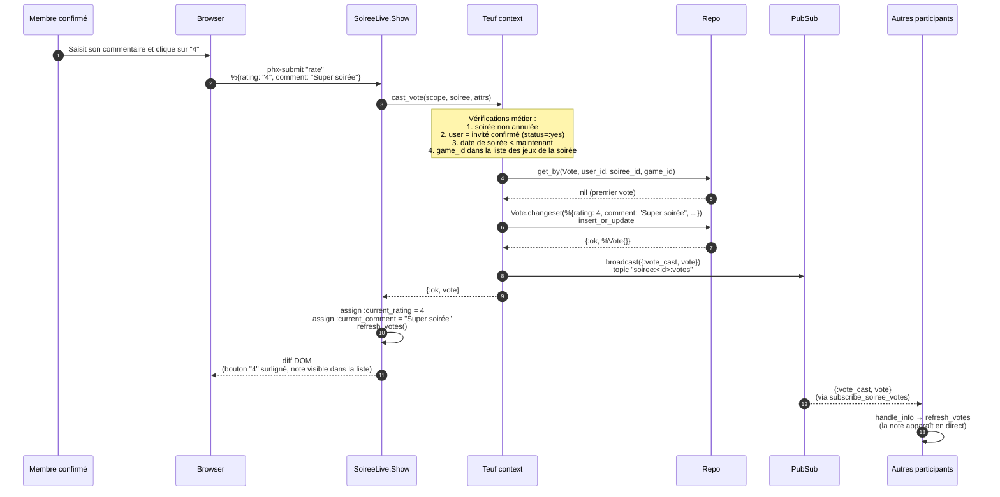
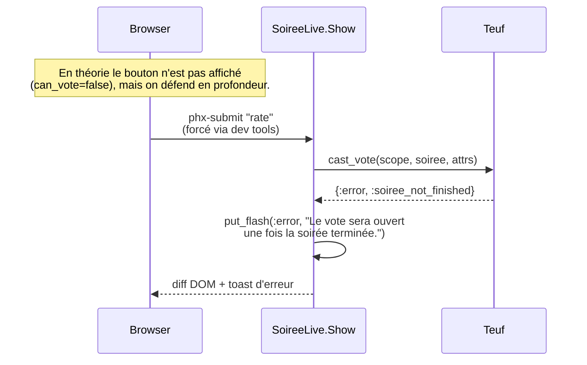
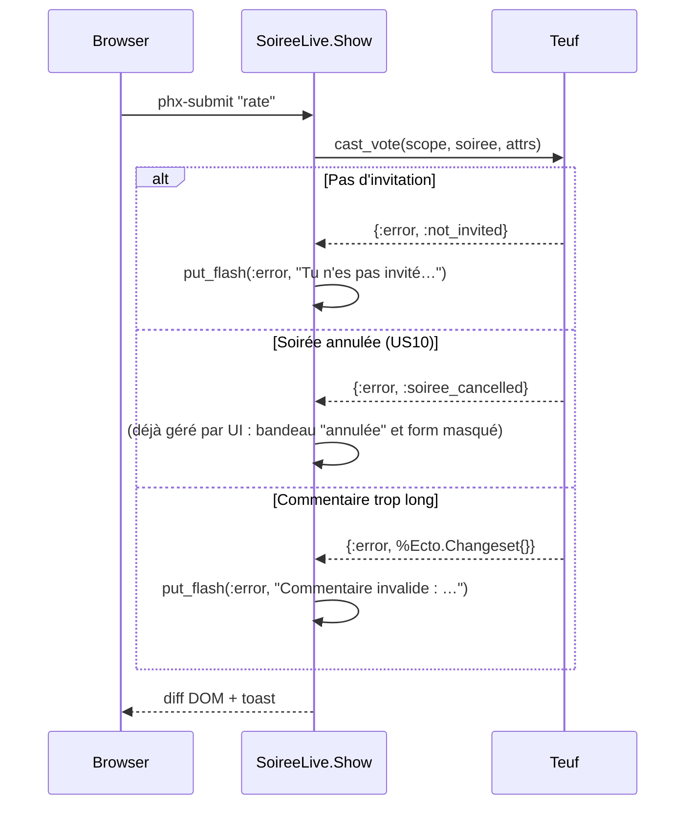
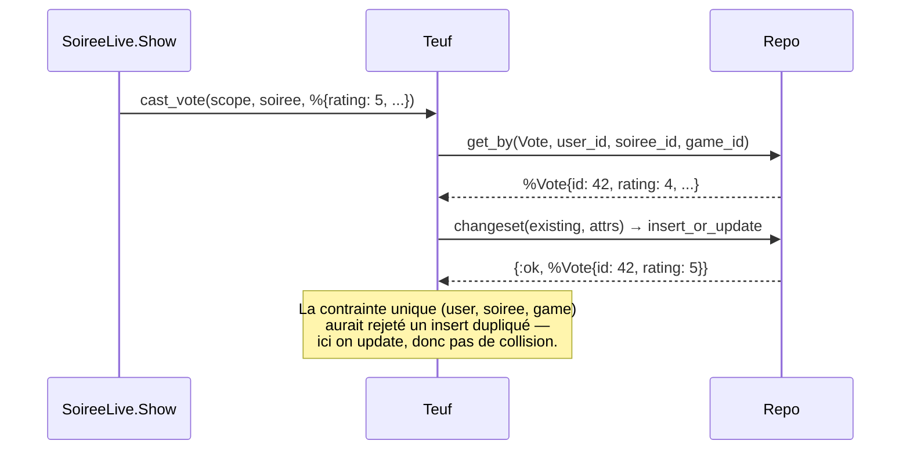

# Diagramme de séquence — Noter un jeu après une soirée

Flow complet du métier "un participant confirmé note le jeu d'une soirée
passée", suggéré par le brief §9 jour 1 comme exemple représentatif.

Couvre US11 : critères d'acceptation + contraintes + cas d'erreur.

## Cas nominal

## Cas d'erreur

### Tentative sur une soirée future

### Tentative par un non-invité ou un invité non-confirmé

## Mise à jour d'une note existante (upsert)

L'utilisateur peut modifier sa note à tout moment (US11 critère
d'acceptation). Le flow nominal est identique, sauf que `Repo.get_by/2`
retourne le `%Vote{}` existant qui est mis à jour via le même changeset.

## Points évaluables

- Toutes les validations (RSVP, date, statut) sont **côté serveur** dans
  `Teuf.cast_vote/3` — l'UI les double mais ne s'y fie pas.
- L'unicité par triplet est garantie au niveau base **et** au niveau Ecto
  (`unique_constraint`).
- Le temps réel via `PubSub` est un bonus UX, pas une dépendance
  fonctionnelle : le LiveView appelle aussi `refresh_votes/1` synchroniquement
  après le succès du `cast_vote` pour ne pas dépendre du round-trip
  PubSub (cf. fix appliqué après le test cassé).
