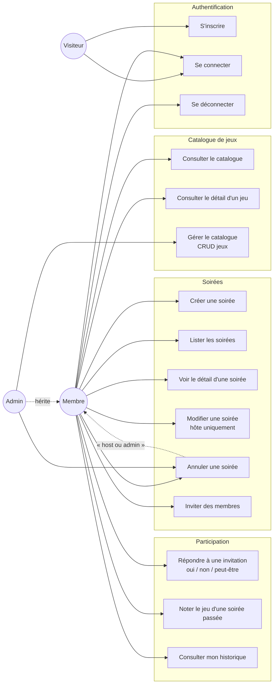

# Diagramme de cas d'usage

Vue d'ensemble des fonctionnalités par acteur.

## Acteurs

- **Visiteur** — non authentifié.
- **Membre** — utilisateur connecté avec rôle par défaut.
- **Admin** — membre avec privilège de gestion du catalogue.

L'admin est aussi un membre (héritage implicite) et peut donc faire tout
ce qu'un membre fait, plus la gestion du catalogue et l'annulation de
n'importe quelle soirée.

## Diagramme

## Correspondance avec les user stories

| Cas d'usage              | US livrée |
|--------------------------|-----------|
| S'inscrire               | US01      |
| Se connecter / déconnecter | US02    |
| Consulter le catalogue   | US04      |
| Détail d'un jeu          | US04      |
| Gérer le catalogue       | US05      |
| Créer une soirée         | US06      |
| Lister les soirées       | US07      |
| Détail d'une soirée      | US08      |
| Modifier une soirée      | US06 (édition implicite) |
| Annuler une soirée       | US10      |
| Inviter des membres      | US06      |
| Répondre à une invitation | US09     |
| Noter le jeu             | US11      |
| Mon historique           | US12      |

## Cas d'usage non livrés (modération)

- **Désactiver un compte** (US13) — réservé aux admins, modération.
- **Supprimer une soirée problématique** (US14) — réservé aux admins.

Voir [`Backlog.md`](../Backlog.md).
